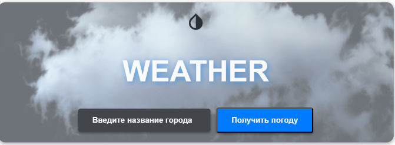
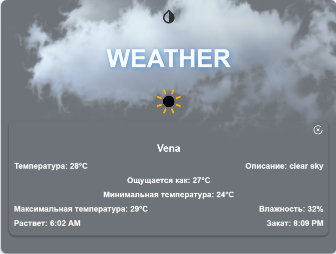
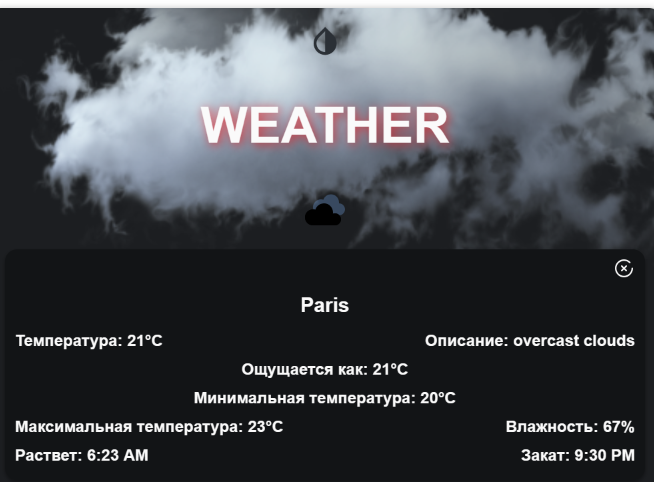

# Weather Widget

### The Weather Widget is a web application that provides real-time weather information for different cities. Users can enter the name of a city and instantly access the current temperature, weather description, humidity, and sunrise/sunset times. The widget offers a user-friendly interface and supports both light and dark themes for a personalized visual experience.






=======
# weather-widget


## Project setup
```
npm install
```

### Compiles and hot-reloads for development
```
npm run serve
```

### Compiles and minifies for production
```
npm run build
```

### Lints and fixes files
```
npm run lint
```

### Customize configuration
See [Configuration Reference](https://cli.vuejs.org/config/).
